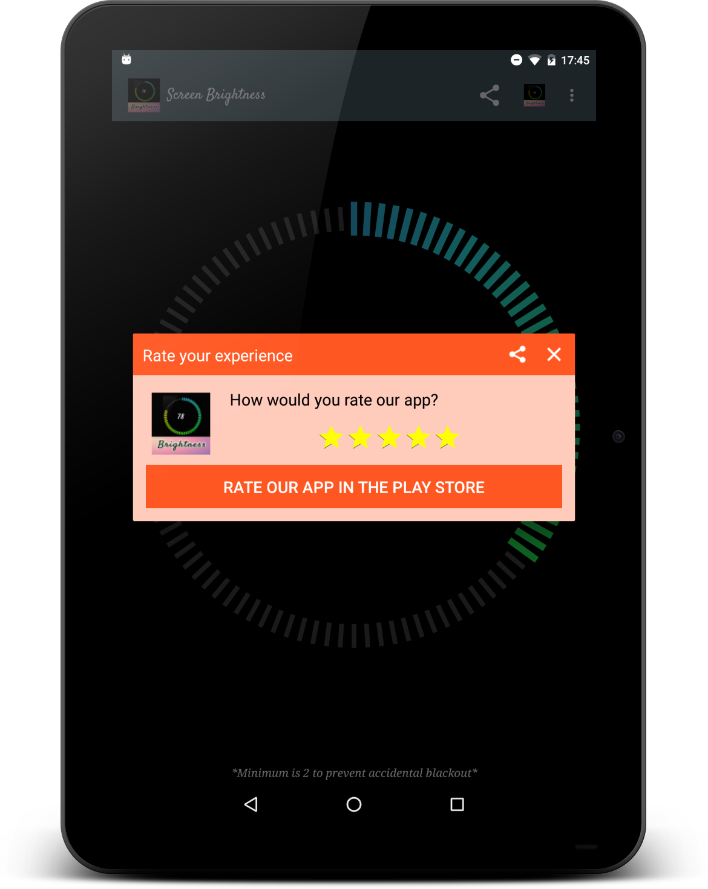
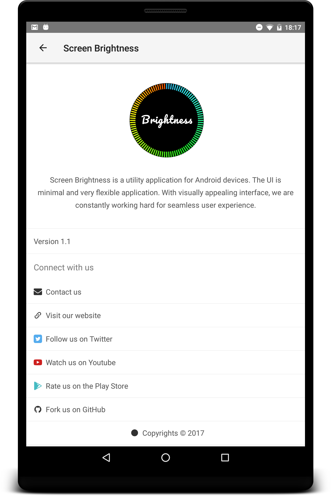

# Copy-Save-for-Android
The app stores persistent clipboard text indefinitely. Everything a user copies in the clipboard is stored forever unless user explicitly deletes it.  Captures the copied data automatically.

<figure>
    <figcaption>App Icon:</figcaption>
    
</figure>


## Idea:
The idea of the application came to me when I had to use some text that I copied a day before but couldn't retreive it because the clipboard only stores ine thing at a time. That's when I decided to make my own thing and it works flawlessly.

## TLDR: the idea popped up out my own needs.

## Screenshots:

| | |
|:-------------------------:|:-------------------------:|
|  SC 1 |  SC 2|  |
|  SC 3 |  SC 4|  |
|  SC 5 |  SC 6|  |

## Demo:


## Working:
The app creates and starts Android service that continuosly monitors the clipboard and whenever any text or data is copied into the clipboard it responds to the program that initally for the first time creates a Realm database and then appends the data to it. 

To prevent data redundancy the program computes the hash of the text which is used as the primary key to avoid duplciates and make it able to recognize previously stored text. 

```java
if (clipboardManager.hasPrimaryClip()) {
            if (clipboardManager.getPrimaryClip().getDescription().hasMimeType(ClipDescription.MIMETYPE_TEXT_PLAIN) ||
                    clipboardManager.getPrimaryClip().getDescription().hasMimeType(ClipDescription.MIMETYPE_TEXT_HTML)) {

                final ClipData clipData = clipboardManager.getPrimaryClip();

                if (clipData.getDescription().hasMimeType(ClipDescription.MIMETYPE_TEXT_PLAIN)) {

                    realm.executeTransaction(new Realm.Transaction() {
                        @Override
                        public void execute(Realm realm) {

                            MyPojos temp = new MyPojos();
                            Log.i(TAG, "execute: clipdata:  " + clipData);
                            temp.setData(clipData.getItemAt(0).getText().toString());
                            // Compute Hash and set it as primary key for the table, prevents redundancy
                            temp.setId(temp.getData().hashCode() + ""); //UUID.randomUUID().toString());
                            realm.copyToRealmOrUpdate(temp);
                            counter++;
                            editor.putInt("counter", counter);
                            editor.commit();

                            if (toast == null || toast.getView().getWindowVisibility() != View.VISIBLE) {
                                toast = Toast.makeText(getBaseContext(), "Got it!", Toast.LENGTH_SHORT);
                                toast.show();
                            }
                        }
                    });
                }
            } else {
                Log.i(TAG, "performClipboardCheck: fired can't work with image or incompatible data");
            }
```

## Libraries Used:
- Realm Database backend
- AutoFitTextView ('me.grantland:autofittextview:0.2.1')
- Google Play Services backend
- Android About Page(https://github.com/medyo/android-about-page)
- Paper onboarding (https://github.com/Ramotion/paper-onboarding-android)

## Current Status:
Currently, the application is unpublished from the Play Store market. The reason being, the app has integrated ads and as per my student visa regulations in United States I am not allowed to have any source of passive income and I had to take the app down. I am planning on working on it and republish it without any ads for free.


